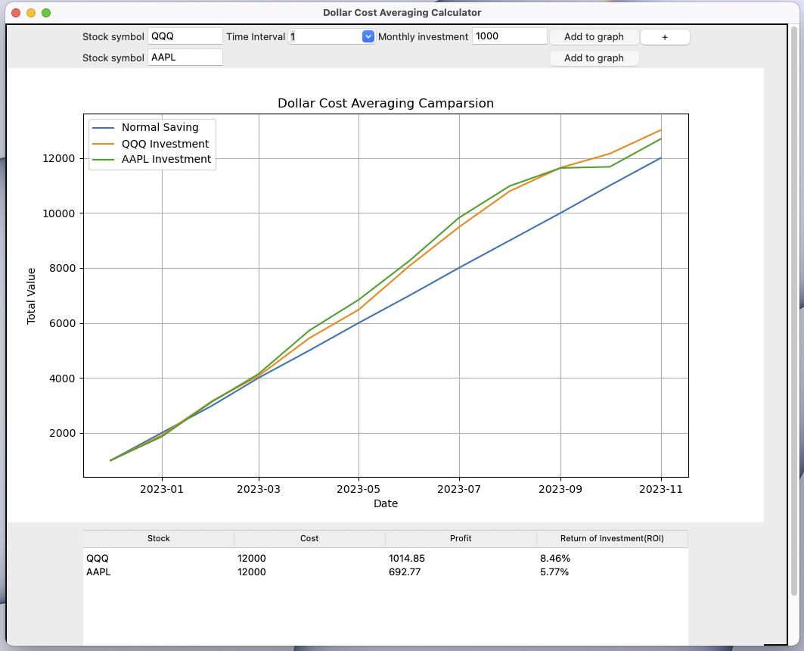

# Dollar Cost Averaging Calculator

## Overview

This is a simple Dollar Cost Averaging (DCA) calculator implemented using Python and the Tkinter library for the graphical user interface (GUI). The calculator allows users to input stock symbols, time intervals, and monthly investment amounts to visualize the performance of their investments over time.Stock data is fetched by yahoo finance api(yfinance).https://finance.yahoo.com
## Features

- **Add Multiple Stocks:** Users can add multiple stocks to the graph, and the application will display the combined performance.
- **Graphical Representation:** The application uses Matplotlib to graphically represent the investment performance over time.
- **Dollar Cost Averaging Comparison:** The graph compares the performance of Dollar Cost Averaging against normal saving over a specified time period.

## Getting Started

1. **Prerequisites:**
   - Ensure you have Python installed on your system.
   - Install required packages by running: `pip install pandas pandas_datareader matplotlib yfinance`

2. **Run the Application:**
   - Execute the script using the command: `python dollar_cost_avg_calculator.py`

3. **Usage:**
   - Input the stock symbol, time interval (1, 3, or 5 years), and monthly investment.
   - Click "Add to graph" to see the performance graph.
   - Use the "+" button to add more stocks for comparison.

## Application Structure

- **Frames:**
   - **StockSearchFrame:** Frame for entering stock details and initiating graph creation.
   - **CanvaFrame:** Frame for displaying the Matplotlib graph.
   - **TableFrame:** Frame for displaying a summary table.

- **Graphical Representation:**
   - Matplotlib is used to create a line graph representing the investment performance.

- **Table View:**
   - The application includes a Treeview widget displaying a summary table of stocks, costs, profits, and return on investment (ROI).

## Contributing

If you'd like to contribute or report issues, feel free to submit a pull request or open an issue.

## License

This Dollar Cost Averaging Calculator is licensed under the [MIT License](LICENSE).

## Acknowledgments

Special thanks to the contributors of the libraries used in this project: Tkinter, Matplotlib, yfinance and pandas.

--- 
